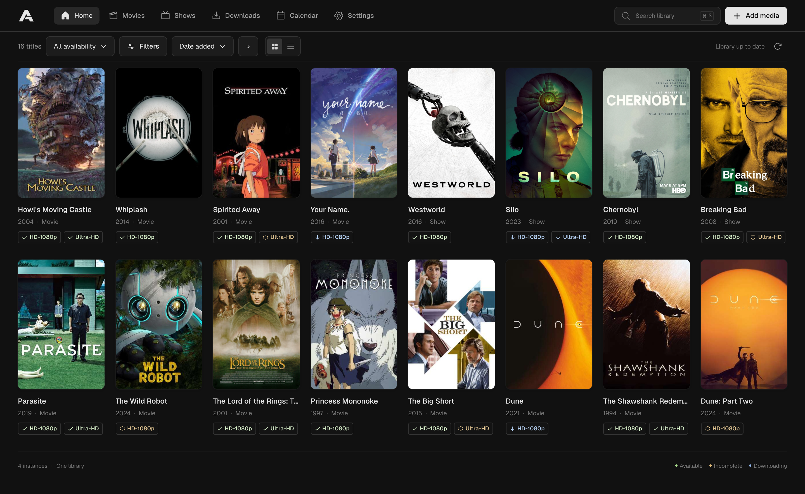

# Arrsenal

**One home for your Sonarr and Radarr libraries.**

Arrsenal brings your movies, shows, and download queues into one web interface, even when your HD and 4K libraries live on separate instances.



*Poster artwork belongs to its respective owners.*

## What you can do

- Browse one library with poster and list views, search, sorting, and filters.
- See each title's availability and quality across your Sonarr and Radarr instances.
- Add movies and shows to multiple instances with a quality profile and root folder for each.
- Search for releases, inspect rejection reasons, and manage a combined download queue.
- Manage movies, shows, seasons, and episode files from their detail pages.

Arrsenal is a companion to Sonarr and Radarr, not a replacement. They still handle indexers, download clients, quality profiles, root folders, and media management. See the [usage guide](docs/usage.md) for details and action limitations.

## Before you start

You need:

- At least one running **Sonarr or Radarr** instance and its API key, found under **Settings > General > Security** in that application.
- A URL for each instance that is reachable from the machine or container running Arrsenal.
- **Docker with Docker Compose** for the quick start below. Prefer running from source? Follow the [Bun development setup](docs/development.md#run-locally).

> **Secure it before sharing it.** Arrsenal starts without an account. Anyone who can reach it can view your library and change settings. The example below publishes port 3000 on all host interfaces. Enable an account in **Settings > Security** during initial setup, keep the port off the public internet, and use HTTPS on untrusted networks. [Security and account recovery →](docs/security.md)

## Quick start (Docker)

### 1. Start Arrsenal

Save this as `compose.yaml` in a new directory. No repository checkout is required.

```yaml
services:
  arrsenal:
    image: ghcr.io/davidchalifoux/arrsenal:latest
    ports:
      - "3000:3000"
    volumes:
      - arrsenal-config:/config
    extra_hosts:
      - "host.docker.internal:host-gateway"
    restart: unless-stopped

volumes:
  arrsenal-config:
```

Run from that directory:

```sh
docker compose pull
docker compose up -d
```

Open **[http://localhost:3000](http://localhost:3000)** on the Docker host, or `http://<server-ip>:3000` from another machine on your LAN. Your library will be empty until you connect an instance.

### 2. Connect Sonarr or Radarr

1. Select **Connect an instance**.
2. Choose the application type, give it a recognizable name (such as `Movies HD`), and enter its URL and API key.
3. Select **Test connection**, then **Connect instance** to save it.
4. Repeat for any other instances. Arrsenal combines matching titles while keeping each instance's quality and availability separate.

**Running Sonarr or Radarr on the Docker host?** Use `http://host.docker.internal:8989` for Sonarr or `http://host.docker.internal:7878` for Radarr—not `localhost`. For shared Docker networks, remote servers, or reverse proxies, see [networking](docs/deployment.md#networking-and-reverse-proxies).

### 3. Explore your library

Browse or filter your titles, open a movie or show to see its instance-specific targets, and check the combined queue. To add a title, configure quality profiles and root folders in Sonarr/Radarr first, then choose them for each target in Arrsenal.

Connections and preferences persist in the `arrsenal-config` volume. API keys stay server-side, but are stored in plaintext in the private configuration file: protect the volume and its backups. [Configuration and backups →](docs/configuration.md)

## Guides and reference

| Guide | What you'll find |
| --- | --- |
| [Using Arrsenal](docs/usage.md) | Features, live updates, action behavior, and safe deletion |
| [Deployment](docs/deployment.md) | Docker updates, version pinning, source builds, networking, proxies, and troubleshooting |
| [Configuration and backups](docs/configuration.md) | Storage locations, permissions, backups, and configuration recovery |
| [Security and account recovery](docs/security.md) | Authentication, public artwork, HTTPS, sessions, and forgotten credentials |
| [Development](docs/development.md) | Bun setup, application structure, tests, and CI |
| [Release automation](docs/releases.md) | Contributor commit conventions and maintainer publishing procedures |
| [Client data reference](src/lib/README.md) | Query caches, collections, and browser realtime behavior |
| [Backend reference](src/lib/server/README.md) | API contracts, validation, storage, and upstream limits |

For version history, see [GitHub Releases](https://github.com/davidchalifoux/arrsenal/releases) or the [changelog](CHANGELOG.md). **Settings > About** shows your installed version and checks for the latest stable release. Report problems through [GitHub Issues](https://github.com/davidchalifoux/arrsenal/issues).

Arrsenal is not endorsed by TMDB, TheTVDB, Sonarr, or Radarr.
